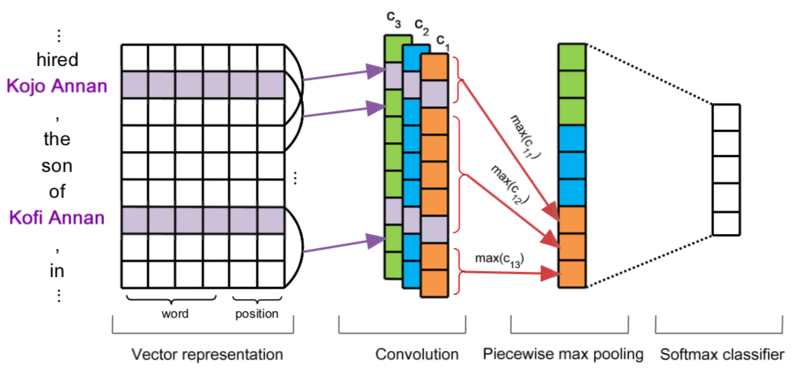
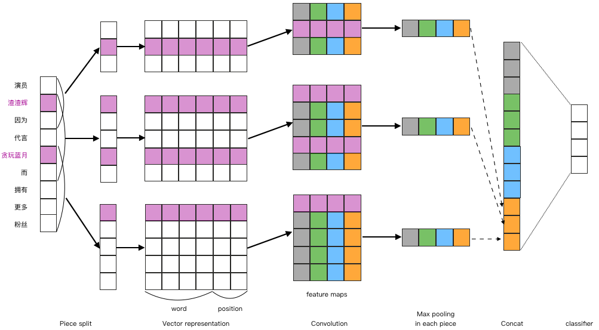

# PCNN

Piecewise Convolution Neural Network is one kind of Neural architecture for [Relation Extraction](https://en.wikipedia.org/wiki/Relationship_extraction) in NLP.  
Applying one traditional single layer Convolution on sentence embeddings can capture n-gram features. After max pooling, only the strongest feature return, which is insufficient for Relation Extraction tasks.  
The PCNN architecture divide one sentence into three parts according to entities positions. This modification improve the capability of Relation Extraction.  
The original architecture of PCNN is as follows.  

This project re-implement the paper, [Distant Supervision for Relation Extraction via Piecewise Convolutional Neural Networks](http://www.emnlp2015.org/proceedings/EMNLP/pdf/EMNLP203.pdf), in Tensorflow.   
Since it is still unsupported to split tensors into variable lengths. The architecture is modified slightly.  


## Getting Started

### Prerequisites
- Python3(build with 3.6)

### Installing
#### Required
Install python package in virtual environment
```
pip install -r requirements
```
#### Optional
If you want to shuffle dataset, shuf is needed.
Shuf is already installed on Linux.   
Usage
```
shuf -o ./path/to/shuf_data ./path/to/origin_data
```
If you use OS X, [gshuf](https://apple.stackexchange.com/questions/142860/install-shuf-on-os-x) is the replacement.
```
brew install coreutils
```
```
gshuf -o ./path/to/shuf_data ./path/to/origin_data
```
You can configure `./model/config.py` to set shuffle.

### Download Dataset
```
make download
```

### Run
Run this project.
```
make run
```

#### Tensorboard
Using tensorboard
```
tensorboard --logdir="./graph" --port 6006
```
Open browser in `http://localhost:6006/`


## License
This project is licensed under the Apache License - see the [LICENSE.txt](http://www.apache.org/licenses/LICENSE-2.0) file for details

## Cite
```
@inproceedings{Zeng2015DistantSF,
  title={Distant Supervision for Relation Extraction via Piecewise Convolutional Neural Networks},
  author={Daojian Zeng and Kang Liu and Yubo Chen and Jun Zhao},
  booktitle={EMNLP},
  year={2015}
}
```
